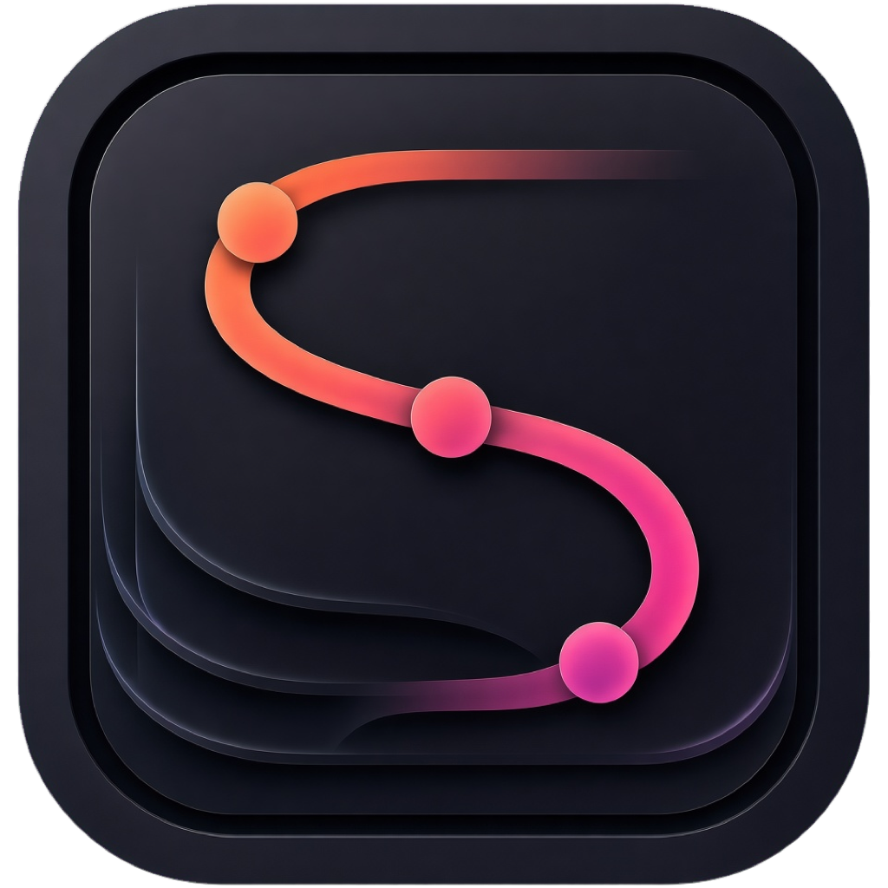

<!-- version-pointer: 由 scripts/bump-version.sh 自动同步 -->
<p align="center">
  
</p>

<h1 align="center">SnapFlow macOS</h1>

<p align="center">
  原生 macOS 菜单栏工具：截图、识别、翻译，并整理屏幕上的重要内容。
</p>

<p align="center">
  <a href="../README.zh-CN.md">项目总览</a> ·
  <a href="https://zeycode.cn/snapflow/">用户手册</a> ·
  <a href="https://github.com/abingtang/snap-flow/releases/latest">下载安装</a> ·
  <a href="README.md">English</a>
</p>

<p align="center">
  
  
  
</p>

SnapFlow macOS 使用 Swift 6、SwiftUI、AppKit、ScreenCaptureKit、Vision 和 Translation 构建。应用将截图到结果的流程放在菜单栏附近，并把有用结果保存在本机，方便之后复用。

## 项目概览

| 项目 | 当前值 |
|------|--------|
| 版本 | **0.0.4** |
| 系统要求 | macOS 15.0 或更高版本 |
| 技术栈 | Swift 6 · SwiftUI + AppKit · ScreenCaptureKit · Vision · Translation |
| 发行架构 | Apple Silicon（`arm64`） |
| 分发方式 | [GitHub Releases](https://github.com/abingtang/snap-flow/releases) |

## 下载安装

请从 [GitHub Releases](https://github.com/abingtang/snap-flow/releases/latest) 下载最新 arm64 ZIP 或 DMG，然后将 `SnapFlow.app` 移入「应用程序」。

Intel Mac 可以从源码构建。系统翻译能力取决于当前 macOS 版本提供的系统能力。

未签名或未公证的构建首次打开时，可能需要在 Finder 中右键选择「打开」，或在「系统设置 → 隐私与安全性」中允许打开。

## 功能概览

| 功能 | 说明 |
|------|------|
| 区域截图 | 冻结屏幕，框选区域或窗口，使用放大镜，完成标注、复制、保存或贴图。 |
| 滚动截屏 | 手动滚动采集内容并拼接成长图，支持预览、保存、复制和贴图。 |
| 贴图 | 将截图固定在屏幕上，支持复制、保存、收藏和 OCR。 |
| OCR | 使用本机 Vision，也可以配置百度、有道、腾讯、火山、Google 和自定义 HTTP 服务。 |
| 翻译 | 使用 Apple Translation，以及已配置的云服务或模型服务翻译选中文本和截图。 |
| 剪切板历史 | 搜索文本、富文本、图片和文件，并支持固定、收藏、还原和粘贴。 |
| 历史与收藏 | 集中搜索和还原截图、OCR 结果、翻译结果及已保存内容。 |

## 推荐快捷键

快捷键可在「设置」中修改，也可以使用「恢复推荐功能热键」恢复默认值。

| 功能 | 快捷键 |
|------|--------|
| 区域截图 | **⌃⌥A** |
| 贴到屏幕 | ⌃⌥P |
| 区域 OCR | ⌥⌘O |
| 截图翻译 | ⌥⌘T |
| 划词翻译 | ⌥⌘S |
| 剪切板历史 | ⌥⌘V |

框选区域后，工具栏提供标注、滚动截屏、OCR、截图翻译和原图翻译入口。窗口内快捷键见「设置」中的对应分组。

## 权限与服务配置

| 权限 | 用途 |
|------|------|
| 屏幕录制 | 区域截图、滚动截屏、OCR 和截图翻译。 |
| 辅助功能 | 读取其它应用中的选中文本，用于划词翻译。 |

系统翻译语言包可在「系统设置 → 通用 → 语言与地区 → 翻译语言」中管理。云 OCR 和云翻译服务需要在应用内配置 API Key。

密钥保存在本机设置中，不会上传到 SnapFlow 服务器。SnapFlow 没有后端账号体系。

## 从源码构建

### 环境要求

- macOS 15.0 或更高版本
- Xcode 16 或更高版本
- Swift 6
- 用于本地签名和权限测试的 Apple Development Team

### 打开工程

```bash
git clone https://github.com/abingtang/snap-flow.git
cd snap-flow
open macos/SnapFlow.xcodeproj
```

在 Xcode 中选择 **SnapFlow** Target，配置 **Signing & Capabilities**，然后按 `⌘R` 运行。

本地签名配置可参考 [`Configurations/Signing.xcconfig.example`](Configurations/Signing.xcconfig.example)。本地 `Signing.xcconfig` 和 API Key 不要提交到 Git。

### 使用命令行构建 Debug 版本

请在仓库根目录执行：

```bash
xcodebuild \
  -project macos/SnapFlow.xcodeproj \
  -scheme SnapFlow \
  -configuration Debug \
  build
```

### 构建发行包

请在 `macos/` 目录执行打包脚本：

```bash
cd macos
./scripts/package-release.sh
```

脚本读取 Xcode 工程中的 `MARKETING_VERSION`，并将 App 和安装包写入 `macos/dist/`。打包、签名、公证、Tag 和 GitHub Releases 流程见 [`docs/RELEASE.md`](docs/RELEASE.md)。

## 文档导航

| 文档 | 内容 |
|------|------|
| [`../README.zh-CN.md`](../README.zh-CN.md) | 中文项目总览和通用构建入口。 |
| [`../README.md`](../README.md) | English 项目总览。 |
| [在线用户手册](https://zeycode.cn/snapflow/) | 安装、权限、功能、快捷键和服务配置。 |
| [`docs/RELEASE.md`](docs/RELEASE.md) | 版本、打包、签名和 GitHub Releases 流程。 |

## 源码结构

| 路径 | 内容 |
|------|------|
| `SnapFlow/` | 应用入口、功能、服务、持久化和 AppKit 桥接。 |
| `SnapFlowTests/` | 单元测试和回归测试。 |
| `SnapFlow.xcodeproj/` | Xcode 工程和共享 Scheme。 |
| `Configurations/` | 签名配置示例；本地签名文件保持忽略。 |
| `docs/` | 开发与发布文档。 |
| `scripts/` | 打包、图标和本地构建脚本。 |

## 仓库约定

源码和文档进入 Git，安装包通过 [GitHub Releases](https://github.com/abingtang/snap-flow/releases) 分发。不要提交 `build/`、`dist/`、App 包、安装包、本地签名配置、凭据或 API Key。

提交说明使用仓库约定的 `类型：简短说明` 格式，例如：

```text
功能：完善 OCR 结果窗
修复：调整截图工具栏布局
文档：完善 macOS 构建说明
```
